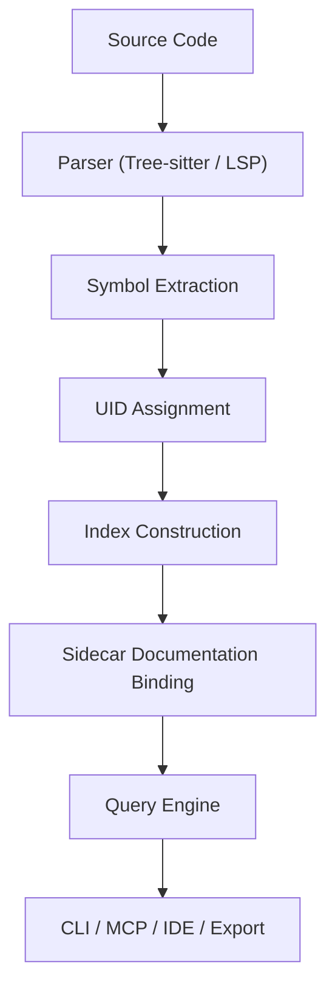
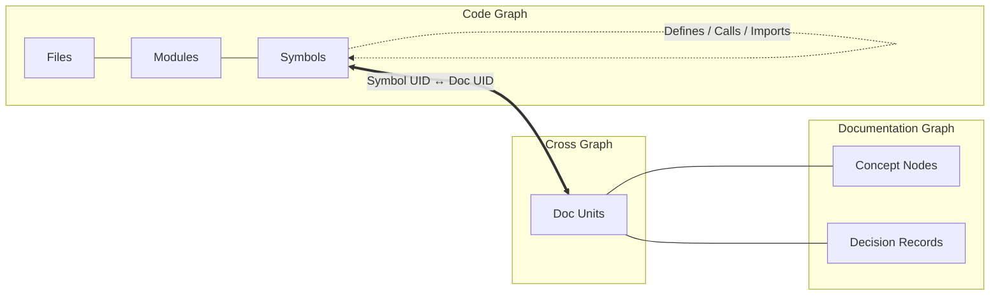

# Architecture Overview

---

## 1. System Summary

Sidecar AI Code Documentation is built as a layered system:

* Parsing layer
* Indexing layer
* Identity layer
* Anchoring layer
* Documentation storage layer
* Query engine
* Interface layer (CLI, MCP, IDE)

Each layer has strict responsibilities.

No layer is allowed to collapse into another.

---

## 2. High-Level Flow

---

## 3. Core Layers

---

### 3.1 Parsing Layer

Responsibilities:

* Parse source files
* Produce AST
* Extract symbols
* Extract definitions
* Extract references
* Capture structural hierarchy

Primary technologies:

* Tree-sitter
* Language Server Protocol
* LSIF / SCIP (optional import)

Output:

* Language-agnostic symbol representation

---

### 3.2 Indexing Layer

*(See [Indexing Specification](INDEXING-SPEC.md))*

Responsibilities:

* Build project-wide symbol graph
* Track:

  * Definitions
  * References
  * Call relationships
  * Module relationships
* Store stable symbol metadata

Data structures:

* Symbol table
* Reference graph
* File graph
* Dependency graph

Output:

* Persistent index store

---

### 3.3 Identity Layer (UID System)

*(See [UID and Cross-Reference Model](UID-AND-XREF-MODEL.md))*

Responsibilities:

* Assign stable identities to:

  * Symbols
  * Modules
  * Files
  * Documentation units
* Maintain UID mapping across re-indexing
* Resolve renames and moves

UID properties:

* Deterministic
* Language-aware
* Hierarchy-aware
* Resistant to formatting changes

UID is the backbone of the system.

---

### 3.4 Anchoring Layer

*(See [Anchoring Specification](ANCHORING-SPEC.md))*

Responsibilities:

* Bind documentation to symbols and structures
* Survive refactors
* Reattach docs after AST changes
* Perform diff-aware rebasing

Anchor strategies:

* Symbol UID
* AST path fingerprint
* Structural selector
* Fuzzy contextual matching

This layer prevents documentation rot.

---

### 3.5 Documentation Storage Layer (Sidecar)

Responsibilities:

* Store documentation outside source files
* Maintain plain-text format
* Reference symbols via UID
* Allow version control

Storage characteristics:

* Human-readable
* Machine-parseable
* Minimal dependencies
* Git-friendly

Sidecar lives alongside the repository.

---

### 3.6 Query Engine

Responsibilities:

* Answer structured queries
* Rank references
* Limit snippet size
* Select fields explicitly
* Provide token-efficient responses

Query examples:

* get_symbol(uid)
* find_references(uid)
* explain_symbol(uid)
* impact_analysis(uid)

Output format:

* Structured JSON
* Optional summarized text
* Ranked results

---

### 3.7 Interface Layer

Interfaces must be thin adapters over the core engine.

Supported interfaces:

* CLI
* MCP server
* VS Code extension
* JetBrains plugin
* CI export

The core engine must remain editor-agnostic.

---

## 4. Internal Data Model

*(See [Data Model Specification](DATA-MODEL.md))*

The system operates on three primary graphs:

### 4.1 Code Graph

Nodes:

* Files
* Modules
* Symbols

Edges:

* Defines
* References
* Calls
* Imports
* Inherits

---

### 4.2 Documentation Graph

Nodes:

* Doc units
* Concept nodes
* Decision records

Edges:

* Refers-to (symbol UID)
* Extends
* Depends-on
* Supersedes

---

### 4.3 Cross Graph

Edges:

* Symbol UID ↔ Doc UID

This allows bidirectional traversal.

---

## 5. Persistence Model

Persistent artifacts:

* Symbol index
* UID map
* Documentation store
* Reference graph
* Optional embedding store (future)

Storage may be:

* SQLite
* RocksDB
* JSON index
* Custom binary format

Implementation choice is secondary to contract stability.

---

## 6. Incremental Updates

Re-indexing must support:

* Single-file changes
* Partial AST updates
* Symbol diffing
* UID preservation
* Anchor rebasing

Full re-indexing must not be required on every change.

---

## 7. Refactor Flow

When code changes:

1. Parse changed file.
2. Detect symbol changes.
3. Compare old and new AST.
4. Preserve UIDs where possible.
5. Rebind anchors.
6. Flag broken anchors.
7. Update reference graph.

Documentation must either:

* Remain attached
* Be deterministically reattached
* Or be marked as unresolved

Silent failure is unacceptable.

---

## 8. Query Lifecycle

Example:

Developer hovers over symbol.

IDE extension:

* Sends request to local server.
* Requests:

  * UID
  * Short summary
  * Top references
  * Impact info

Engine:

* Resolves UID.
* Retrieves structured doc.
* Ranks references.
* Truncates snippets.
* Returns minimal payload.

No raw file dump.

No unnecessary context.

---

## 9. Design Constraints

* Language-agnostic core.
* No dependency on specific IDE.
* Refactor-resilient anchors.
* Token-minimal responses.
* Deterministic behavior.
* Extensible architecture.

---

## 10. Separation of Concerns

Strict boundaries:

| Layer        | Must Not Do               |
| ------------ | ------------------------- |
| Parser       | Store documentation       |
| Index        | Render UI                 |
| UID          | Depend on line numbers    |
| Anchoring    | Parse code                |
| Query Engine | Parse AST                 |
| CLI          | Implement indexing logic  |
| IDE Plugin   | Store state independently |

Each layer exists to reduce coupling.

---

## 11. Future Extensions

* Embedding-assisted semantic search
* Architectural visualization
* Automated inconsistency detection
* AI-generated draft documentation
* CI documentation coverage metrics
* Impact risk scoring

These are additive, not foundational.

---

## 12. System Philosophy

The system is:

* Infrastructure-first
* Identity-first
* Query-first
* Refactor-aware
* AI-compatible

It is not:

* UI-first
* Markdown-first
* Static-site-first

The architecture enforces this philosophy structurally.

