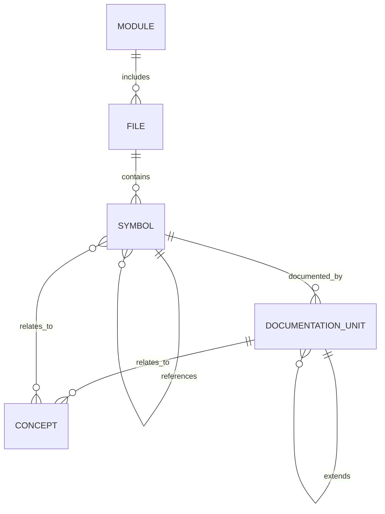

# Data Model Specification

---

## 1. Purpose

This document defines the core data model for the system.

The data model governs:

* Symbol representation
* Documentation representation
* Cross-referencing
* Anchoring
* Query contracts
* Persistence structure

All layers must conform to this model.

Rendering layers must not modify it.

---

## 2. Design Principles

The data model must be:

* Language-agnostic
* UID-first
* Refactor-resilient
* Versioned
* Deterministic
* Extensible
* Minimal but expressive

No field exists without purpose.

No implicit relationships.

Everything is explicit.

---

## 3. Core Entity Types

The system defines the following primary entity categories:

1. Symbol
2. Reference
3. File
4. Module
5. Documentation Unit
6. Anchor
7. Concept (optional abstraction layer)

---

## 4. Symbol Model

Represents any named code construct.

### 4.1 Symbol Entity

```json id="9w42po"
{
  "uid": "sym:lang:path:qualified_name",
  "name": "calculateTotal",
  "qualified_name": "CartService.calculateTotal",
  "kind": "method",
  "language": "typescript",
  "file_uid": "file:src/services/cart.ts",
  "parent_uid": "sym:CartService",
  "visibility": "public",
  "is_exported": true,
  "signature": "(items: Item[]) => number",
  "range": {
    "start": 124,
    "end": 189
  },
  "fingerprint": "structural_hash"
}
```

---

### 4.2 Symbol Kinds

Symbol kinds include:

* module
* class
* struct
* interface
* function
* method
* variable
* constant
* enum
* field
* property
* type_alias
* namespace
* macro (language-dependent)

Kinds must be normalized across languages.

---

## 5. Reference Model

Represents relationship between symbols.

### 5.1 Reference Entity

```json id="8jrtqa"
{
  "from_uid": "sym:OrderProcessor.process",
  "to_uid": "sym:CartService.calculateTotal",
  "type": "call",
  "file_uid": "file:src/order.ts",
  "range": {
    "start": 87,
    "end": 104
  }
}
```

---

### 5.2 Reference Types

Reference types include:

* call
* import
* inherit
* implement
* type_usage
* instantiate
* assign
* override
* extend
* dependency

Reference types must be extensible.

---

## 6. File Model

Represents a source file.

### 6.1 File Entity

```json id="p0c4hx"
{
  "uid": "file:src/services/cart.ts",
  "language": "typescript",
  "hash": "sha256:abcdef1234",
  "defined_symbols": ["sym:..."],
  "imported_modules": ["file:..."],
  "last_indexed_at": "timestamp"
}
```

---

## 7. Module Model

Represents logical grouping.

```json id="8d8qye"
{
  "uid": "module:services",
  "name": "services",
  "parent_uid": "module:src",
  "file_uids": ["file:src/services/cart.ts"]
}
```

Modules abstract language-specific packaging.

---

## 8. Documentation Model

Documentation is stored separately but bound via UID.

### 8.1 Documentation Unit

```json id="m2o8gf"
{
  "doc_uid": "doc:cart-calc-overview",
  "title": "Cart Calculation Logic",
  "content": "This method calculates total cost including tax...",
  "related_symbol_uids": [
    "sym:CartService.calculateTotal"
  ],
  "related_concepts": [
    "concept:pricing-engine"
  ],
  "created_at": "timestamp",
  "updated_at": "timestamp"
}
```

Documentation content must be:

* Plain text or Markdown
* Human-readable
* Machine-parseable
* Detached from source file

---

## 9. Anchor Model

Anchors connect documentation to code structure.

### 9.1 Anchor Entity

```json id="g3f7lt"
{
  "doc_uid": "doc:cart-calc-overview",
  "symbol_uid": "sym:CartService.calculateTotal",
  "anchor_type": "symbol",
  "fingerprint": "structural_hash",
  "confidence": 0.98
}
```

---

### 9.2 Anchor Types

* symbol (primary)
* structural_selector
* file_level
* fuzzy_match
* manual_override

Anchor must store:

* Structural fingerprint
* Last verified state
* Confidence score

---

## 10. Concept Model (Optional Layer)

Concepts abstract higher-level meaning.

Example:

```json id="d9k12z"
{
  "uid": "concept:pricing-engine",
  "name": "Pricing Engine",
  "description": "Handles pricing rules and tax calculations.",
  "related_symbol_uids": [
    "sym:CartService.calculateTotal",
    "sym:TaxCalculator.compute"
  ]
}
```

Concepts allow documentation not tied to a single symbol.

---

## 11. Graph Relationships

The system forms three interconnected graphs:



### 11.1 Code Graph

Nodes:

* Symbol
* File
* Module

Edges:

* Reference
* Containment
* Import

---

### 11.2 Documentation Graph

Nodes:

* Documentation Unit
* Concept

Edges:

* Extends
* Refers-to
* Supersedes

---

### 11.3 Cross Graph

Edges:

* Symbol ↔ Documentation
* Concept ↔ Symbol

---

## 12. Versioning Model

Each entity may include:

* schema_version
* created_at
* updated_at
* source_hash

Index schema changes must bump version.

Documentation schema changes must be migratable.

---

## 13. Confidence and Integrity

Entities may include:

* resolution_confidence
* anchor_confidence
* semantic_confidence

Confidence is required for:

* Fuzzy reattachment
* Partial LSP resolution
* Heuristic symbol matching

---

## 14. Normalization Rules

The model must:

* Normalize language-specific constructs.
* Avoid storing raw AST.
* Avoid storing transient LSP state.
* Avoid UI-specific metadata.

Only canonical semantic data is stored.

---

## 15. Query Contract Compatibility

Data model must support:

* Partial field selection
* Field filtering
* Graph traversal
* Ranking metadata
* Pagination
* Bounded range return

Model must not force full object retrieval.

---

## 16. Persistence Strategy

Entities may be stored in:

* Relational DB (normalized tables)
* Graph DB
* Key-value store
* Hybrid store

Logical model must remain independent of physical storage.

---

## 17. Non-Goals

Data model does not:

* Store rendered HTML
* Store full file text
* Store editor UI state
* Store user preferences
* Store LLM outputs as canonical data

LLM-generated summaries must be stored as documentation units if persisted.

---

## 18. Integrity Rules

The system must enforce:

* UID uniqueness
* Referential integrity
* No orphan references
* Anchor verification on re-index
* Deterministic UID generation

Violations must be flagged.

---

## 19. Extensibility

The model must support:

* Additional symbol metadata
* Additional reference types
* Additional documentation metadata
* Plugin-defined fields

Extensibility must not break core invariants.

---

## 20. Summary

The data model defines:

* Identity
* Structure
* Relationships
* Anchoring
* Documentation binding

It is the canonical representation of knowledge in the system.

Everything else builds on it.
